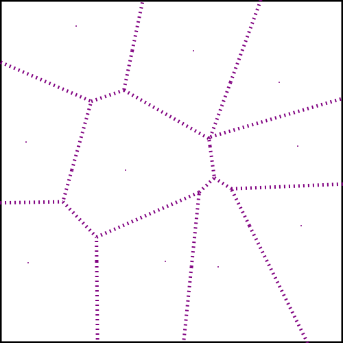

# Nice Effects

In this repo, you will find some of nice effect done with SVGVideoMaker.

## HypnoticEllipse

CLI interface for generate nice ellipse with infinite loop.

```cmd
usage: HypnoticEllipse.py [-nb INT] [-g FLOAT] [-rx INT] [-ry INT] [-d INT] [-t STR] [-s INT] [-ss FLOAT] [-om OUTLINE] [-bg COLOR] [-c R,G,B] [-gdt STR] [-l CAPS STYLE] [-r INT] [-fps INT] [-o FILENAME] [-ext EXTENSION] [-v] [-h]

Arranges randomly sized ellipse arcs into ellipse shape. Animation is make with SVGVideoMaker and can generate animation to gif/mp4.

Generation:
  -nb INT, --ellipse INT
                        number of concentric ellipse arc elements to generate inside the ellipse
  -g FLOAT, --gap FLOAT
                        distance between the generated ellipse
  -rx INT, --x-radius INT
                        setup x radius of ellipse shape
  -ry INT, --y-radius INT
                        setup x radius of ellipse shape
  -d INT, --duration INT
                        Time in second to make one animation. Default 10 seconds
  -t STR, --type STR    Type of generation system.
  -s INT, --seed INT    Seed for initialization of the random number generator for predictable results.

Style:
  -ss FLOAT, --stroke-size FLOAT
                        Stroke size of each ellipse.
  -om OUTLINE, --outline-mode OUTLINE
                        Generate bounding outline ellipse.
  -bg COLOR, --background-color COLOR
                        The background color of animation. If you want transparent, use none
  -c R,G,B, --color R,G,B
                        The color of circles with RGB values. If none, use random color.
  -gdt STR, --gradient STR
                        The sens of gradient for coloring. From color to grey. Need to have a color
  -l CAPS STYLE, --linecaps CAPS STYLE
                        The style of border of ellipse
  -r INT, --rotation INT
                        The sens of rotation. Incompatible with CHAOS type.

Output:
  -fps INT, --frame-per-seconds INT
                        The number of frame per seconds.
  -o FILENAME, --output FILENAME
                        Name of output file.
  -ext EXTENSION, --extension EXTENSION
                        Extension of the output file.

Misc:
  -v, --version         show version number and exit
  -h, --help            show this help message and exit

Report bugs, request features, or provide suggestions via https://github.com/evayann/NiceEffects
```


## Voronoi

CLI interface for generate Voronoi diagram with or without animation.

```cmd
usage: Voronoi.py [-nb INT] [-d INT] [-s INT] [-l BOOL] [-c STR] [-dash STR] [-ss INT] [-dp BOOL] [-wdt INT] [-hgt INT] [-fps INT] [-o FILENAME] [-ext EXTENSION] [-v] [-h]

Make Voronoi Diagram with animation of creation

Generation:
  -nb INT, --points INT
                        Number of points for Voronoi diagram.
  -d INT, --duration INT
                        Time in second for the animation. Default 10 seconds.
  -s INT, --seed INT    Seed for initialization of the random number generator for predictable results.

Style:
  -l BOOL, --line BOOL  Display line for animation. Default is True.
  -c STR, --color STR   The color of Voronoi segment. Default is blue.
  -dash STR, --dasharray STR
                        The string who describe Voronoi segment.
  -ss INT, --stroke-size INT
                        The size of stroke of Voronoi segment.
  -dp BOOL, --display-points BOOL
                        If need to display point.

Output:
  -wdt INT, --width INT
                        Width of output element.
  -hgt INT, --height INT
                        Height of output element.
  -fps INT, --frame-per-seconds INT
                        The number of frame per seconds.
  -o FILENAME, --output FILENAME
                        Name of output file.
  -ext EXTENSION, --extension EXTENSION
                        Extension of the output file.

Misc:
  -v, --version         Show version number and exit.
  -h, --help            Show this help message and exit.

Report bugs, request features, or provide suggestions via https://github.com/evayann/NiceEffects
```




## TerritoryBattle 

CLI interface for generate an animate territory battle.

```cmd
usage: TerritoryBattle.py [-nb INT] [-t INT] [-wdt INT] [-hgt INT] [-d INT] [-s INT] [-f BOOL] [-fps INT] [-o FILENAME] [-ext EXTENSION] [-v] [-h]

Play a territory battle.

Generation:
  -nb INT, --agent INT  Number of agent in the battle.
  -t INT, --turns INT   The number of turn to play during battle.
  -wdt INT, --width INT
                        The width of battle zone.
  -hgt INT, --height INT
                        The height of battle zone.
  -d INT, --duration INT
                        Time in second for the battle. Default 10 seconds.
  -s INT, --seed INT    Seed for initialization of the random number generator for predictable results.

Style:
  -f BOOL, --fill BOOL  If the agent is fill, don't see stroke line. Default is fill (True).

Output:
  -fps INT, --frame-per-seconds INT
                        The number of frame per seconds.
  -o FILENAME, --output FILENAME
                        Name of output file.
  -ext EXTENSION, --extension EXTENSION
                        Extension of the output file.

Misc:
  -v, --version         show version number and exit
  -h, --help            show this help message and exit

Report bugs, request features, or provide suggestions via https://github.com/evayann/NiceEffects
```


